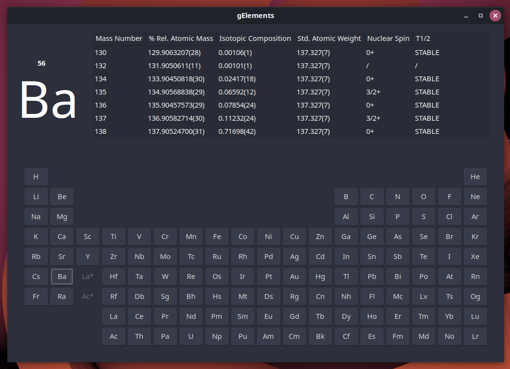

# GOTOSI periodic table

## GTK powered isotope-oriented periodic table of elements



## Atomic Weights and Isotopic Compositions with Relative Atomic Masses

Original Dataset Developers and Contributors:
J. S. Coursey, D. J. Schwab, J. J. Tsai, and R. A. Dragoset
NIST Physical Measurement Laboratory

> The atomic weights are available for elements 1 through 118 and isotopic compositions or abundances are given when appropriate. The atomic weights data were published by J. Meija et al in Atomic Weights of the Elements 2013, and the isotopic compositions data were published by M. Berglund and M.E. Wieser in Isotopic Compositions of the Elements 2009. The relative atomic masses of the isotopes data were published by M. Wang, G. Audi, A.H. Wapstra, F.G. Kondev, M. MacCormick, X. Xu1, and B. Pfeiffer in The AME2012 Atomic Mass Evaluation.

These data have been compiled from the above sources for the user's convenience and does not represent a critical evaluation by the NIST Physical Measurement Laboratory.

### Code Example

```json
{
    "atomic_number": "1",
    "symbol": "H",
    "mass_number": "1",
    "relative_atomic_mass": "1.00782503223(9)",
    "isotopic_composition": "0.999885(70)",
    "standard_atomic_weight": "[1.00784,1.00811]",
    "notes": "m"
  }
```

### Properties Description

- **Atomic Number**

- **Symbol**

- **Mass Number**

- **Relative Atomic Mass** (of the isotope): Ar(X), where X is an isotope
  (formerly called atomic weight; see Standard Atomic Weight below)

> These values are scaled to Ar(12C) = 12, where 12C is a neutral atom in its nuclear and electronic ground state. Thus, the relative atomic mass of entity X is given by: Ar(X) = m(X) / [m(12C) / 12. If # is present, the value and error were derived not from purely experimental data, but at least partly from systematic trends.


- **Representative Isotopic Composition**: Mole fraction of the various isotopes

> In the opinion of the Subcommittee for Isotopic Abundance Measurements (SIAM), these values represent the isotopic composition of the chemicals and/or materials most commonly encountered in the laboratory. They may not, therefore, correspond to the most abundant natural material. The uncertainties listed in parenthesis cover the range of probable variations of the materials as well as experimental errors. These values are consistent with the values published in Isotopic Compositions of the Elements 2009.


- **Standard Atomic Weight** (common usage): Ar(X), where X is an element
  (more appropriately called __relative atomic mass of the element__)

> The relative atomic mass of an element is derived by averaging the relative atomic masses of the isotopes of that element. These values are scaled to Ar(12C) = 12, where 12C is a neutral atom in its nuclear and electronic ground state. These values are dependent on the origin and treatment of the material.

> For several of these elements, the standard atomic weight is given as an atomic-weight interval with the symbol [a, b] to denote the set of atomic-weight values in normal materials; thus, [a ≤ Ar(E) ≤ b]. The symbols a and b denote the lower and upper bounds of the interval [a, b], respectively. The values in parentheses, following the last significant digit to which they are attributed, are uncertainties.

> Brackets [ ] enclosing a single value indicate the mass number of the most stable isotope. For radioactive elements with atomic numbers 95 or greater, the mass number of the most stable isotope is not specified, as the list of studied isotopes is still incomplete.

### Notes

#### Notes for Representative Isotopic Composition and Standard Atomic Weight

- **g**:	Geological materials are known in which the element has an isotopic composition outside the limits for normal material. The difference between the atomic weight of the element in such materials and that given in the table may exceed the stated uncertainty.
- **m**:	Modified isotopic compositions may be found in commercially available material because the material has been subjected to an undisclosed or inadvertent isotopic fractionation. Substantial deviations in atomic weight of the element from that given in the table can occur.
- **r**:	Range in isotopic composition of normal terrestrial material prevents a more precise standard atomic weight being given; the tabulated atomic-weight value and uncertainty should be applicable to normal materials.

## Nuclear Spin and half-life

### Code Example 

```json
{
   "Nucleus": "1H",
   "Elevel(keV)": "0.0",
   "Spin": "1/2+",
   "T1/2": "STABLE"
 }
```

